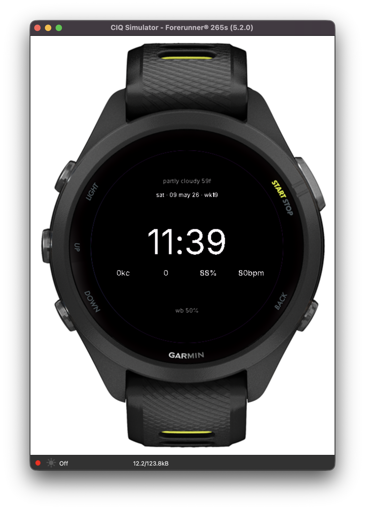

# Pokeface — a micro-graphics watch face for the Forerunner 265S

A text-only, brutalist-modernist watch face inspired by the
[micro-graphics aesthetic](https://www.openallhours.co/p/how-micro-graphics-went-from-an-afterthought-to-an-aesthetic):
small grotesque type, dense data, mathematical placement.



Built around four ideas:

1. **Grotesque typography** — Inter (open-source Akzidenz-Grotesk successor)
   baked into bitmap fonts at four hand-picked sizes.
2. **LaTeX-style layout** — every text row is positioned by a Python solver
   ([`art/build_layout.py`](art/build_layout.py)) that reads real glyph widths
   from the `.fnt` atlases and verifies each row fits inside the round-display
   chord at its y. Overflow = compile failure.
3. **Day / night palette inversion** — white-on-black during daylight,
   black-on-white after sunset, decided live from
   `Toybox.Weather.getSunrise/getSunset`.
4. **Honest data, lowercase** — weather (live), date, time, calories,
   compact step count, body battery, heart rate, watch battery, sun times.

## Layout

```
                    cloudy 55f                   ← live weather (header)
              tue · 09 may 26 · wk19             ← date

                       10:42                      ← time

      342kc        6.4k       73%       72bpm     ← cal · steps · bb · hr

              wb 78% · sun 6:24a 8:42p            ← watch battery + sun
```

## One-time setup

1. Install the **Connect IQ SDK** from <https://developer.garmin.com/connect-iq/sdk/>
   via SDK Manager. Pick the latest SDK + the `fr265s` device package.
2. Install the **Monkey C** VS Code extension (`garmin.monkey-c`).
3. Java 17 is required by the SDK toolchain. On macOS:
   `brew install openjdk@17`.
4. Generate a developer key once:
   ```
   openssl genrsa -out key.pem 4096
   openssl pkcs8 -topk8 -inform PEM -outform DER -in key.pem -out developer_key.der -nocrypt
   ```

## Build, test, sideload

The bundled [`run.sh`](run.sh) wraps everything:

```bash
./run.sh             # build + sideload to simulator once
./run.sh --watch     # rebuild + reload on every save
./run.sh --art       # regenerate placeholder art / fonts first
./run.sh --release   # build release (-r), no debug symbols
./run.sh --build     # build only, don't launch simulator
```

Things to exercise in the simulator:

- **Settings → Time of Day** — scrub past sunset to flip to the inverse
  black-on-white night palette.
- **Settings → Conditions** — change weather to verify the lowercase header
  re-renders (e.g. `clear 72f`, `rain 51f`, `snow 28f`).
- **Settings → Sensors → Activity Data** — bump calories / steps and watch
  the values update.

To install on the actual watch: plug it in via USB, allow Mass Storage Mode
when prompted, then:

```bash
cp bin/Pokeface.prg /Volumes/GARMIN/GARMIN/Apps/
diskutil eject /Volumes/GARMIN
# Long-press LIGHT on the watch → Watch Face → Pokeface.
```

## Project layout

```
.
├── manifest.xml             fr265s + SensorHistory permission
├── monkey.jungle            build config
├── run.sh                   build / reload / watch helper
├── source/
│   ├── PokefaceApp.mc       AppBase entrypoint
│   └── PokefaceView.mc      WatchFace — drawing, day/night, helpers
├── resources/
│   ├── strings/strings.xml
│   ├── settings/properties.xml
│   ├── drawables/drawables.xml + launcher_icon.png
│   └── fonts/inter_*.fnt + .png      Inter @ 11/14/22/64 px
└── art/
    ├── build_fonts.py       TTF → Garmin BMFont .fnt + bitmap atlas
    └── build_layout.py      LaTeX-style solver: chord math + row widths
```

## How the layout solver works

[`art/build_layout.py`](art/build_layout.py) declares each row as
`(y, font, alignment, content)` and runs three checks before any build:

1. Reads the per-glyph `xadvance` from the `.fnt` files so widths match what
   Garmin will actually render.
2. Computes the available chord at every y on the round display:
   `2·√(r² − (y − cy)²)`, with a 10 px bezel margin.
3. For `spread:N` rows, splits the chord into N evenly-spaced columns and
   verifies the longest item fits its column.

If a row overflows, the solver exits non-zero — push the row up/down,
shrink the font, or shorten the text. When all rows fit, transcribe the
emitted y-coordinates into [`PokefaceView.mc`](source/PokefaceView.mc).

## Notes

- `onUpdate` fires roughly once per minute; the face is intentionally
  static within a minute to keep AMOLED battery drain low.
- Body battery and heart rate require the `SensorHistory` permission
  (already declared in [`manifest.xml`](manifest.xml)).
- The screenshot above is captured directly from the Connect IQ
  Simulator running on macOS.
